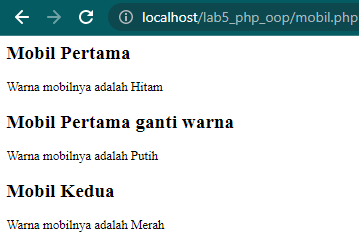
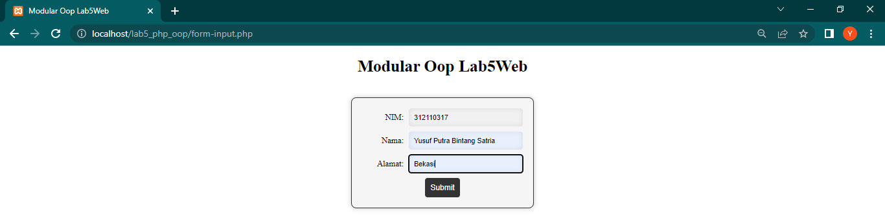

# Lab5Web
# Praktikum 5: PHP OOP

### Instruksi Praktikum
1. Persiapkan text editor misalnya VSCode.
2. Buat folder baru dengan nama lab5_php_oop pada docroot webserver (htdocs)
3. Ikuti langkah-langkah praktikum yang akan dijelaskan berikutnya.


# Langkah Praktikum

## Class Dasar
- Buat file baru dengan nama `mobil.php`. Kemudian masukan kode berikut.

```php
<?php

class Mobil
{
    private $warna;
    private $merk;
    private $harga;

    public function __construct()
    {
        $this->warna = "Hitam";
        $this->merk = "Rolls-Royce Boat Tail";
        $this->harga = "450000000000";
    }

    public function set_warna($value)
    {
        $this->warna = $value;
    }

    public function get_warna()
    {
        return "Warna mobilnya adalah " . $this->warna;
    }
}

// Deklarasi class
$mobil_pertama = new Mobil();
$mobil_kedua = new Mobil();

// Memanggil object
?>

<h2>Mobil Pertama</h2>

<?= $mobil_pertama->get_warna(); ?>

<h2>Mobil Pertama ganti warna</h2>

<?php
$mobil_pertama->set_warna("Putih");
echo $mobil_pertama->get_warna(); 
?>

<h2>Mobil Kedua</h2>

<?php
$mobil_kedua->set_warna("Merah");
echo $mobil_kedua->get_warna();
```

- Maka hasilnya seperti berikut.



## Membuat Form (Class Library)
<p>Class library merupakan pustaka kode program yang dapat digunakan bersama pada beberapa file
yang berbeda (konsep modularisasi). Class library menyimpan fungsi-fungsi atau class object
komponen untuk memudahkan dalam proses development aplikasi.</p>

- Buat file baru dengan nama `form-input.php`. Kemudian masukan kode berikut.

```php
<?php
require_once 'includes/database.php';
require_once 'includes/form.php';

$db = new Database();
$conn = $db->getConnection();
$form = new Form($conn);
?>

<!DOCTYPE html>
<html>
<head>
<head>
  <meta name="viewport" content="width=device-width, initial-scale=1.0">
</head>

	<title>Modular Oop Lab5Web</title>
  <link rel="stylesheet" type="text/css" href="includes/form.css">
</head>
<body>
	<h1>Modular Oop Lab5Web</h1>
	<?php
	// Check if form is submitted
	if ($_SERVER['REQUEST_METHOD'] == 'POST') {
		// Process form data
		$form->processForm($_POST);
	}
	// Display form
	$form->displayForm();
	?>
</body>
</html>
```

- Buat folder baru di dalam folder `Lab5Web` dengan nama `includes`.
- Kemudian, buat file baru di dalam folder `includes` dengan nama `config.php`.
- Isi file `config.php` dengan kode berikut:

```php
<?php
define('DB_HOST', 'localhost');
define('DB_USER', 'root');
define('DB_PASS', '');
define('DB_NAME', 'latihan1');
?>
```

- Kemudian, buat koneksi ke database pada file `database.php` dengan kode berikut:

```php
<?php
require_once 'config.php';

class Database {
	private $conn;

	public function __construct() {
		$this->conn = new mysqli(DB_HOST, DB_USER, DB_PASS, DB_NAME);
		if ($this->conn->connect_error) {
			die('Connection failed: ' . $this->conn->connect_error);
		}
	}

	public function getConnection() {
		return $this->conn;
	}
}
?>
```

- Lalu buat file baru di dalam folder `includes` dengan nama `form.php`. Dan masukan kode berikut.

```php
<?php
class Form {
	private $conn;

	public function __construct($conn) {
		$this->conn = $conn;
	}

	public function displayForm() {
		echo '<form method="POST" action="' . htmlspecialchars($_SERVER["PHP_SELF"]) . '">';
		echo '<label for="nim">NIM:</label>';
		echo '<input type="number" name="nim" required><br>';
		echo '<label for="nama">Nama:</label>';
		echo '<input type="text" name="nama" required><br>';
		echo '<label for="alamat">Alamat:</label>';
		echo '<input type="text" name="alamat" required><br>';
		echo '<input type="submit" value="Submit">';
		echo '</form>';
	}

	public function processForm($data) {
		$nim = $data['nim'];
		$nama = $data['nama'];
		$alamat = $data['alamat'];

		$sql = 'INSERT INTO data_mahasiswa (nim, nama, alamat) VALUES (?, ?, ?)';
		$stmt = $this->conn->prepare($sql);
		$stmt->bind_param('sss', $nim, $nama, $alamat);
		$stmt->execute();
	}
}
?>
```

- Kemudian tambahkan sedikit css agar terlihat rapih dan menarik.
- Buat file baru dengan nama `form.css` di dalam folder `includes`.
- Isi file `form.css` dengan kode berikut:

```css
body {
  text-align: center;
}

form {
  display: inline-block;
  margin: 20px auto;
  padding: 20px;
  border: 2px solid #333;
  border-radius: 10px;
  background-color: #f5f5f5;
  box-shadow: 0 0 10px rgba(0, 0, 0, 0.2);
}
  
  label {
  display: inline-block;
  width: 80px;
  text-align: right;
  margin-right: 10px;
  }
  
  input[type="text"],
  input[type="number"] {
  width: 200px;
  padding: 10px;
  border-radius: 5px;
  border: none;
  margin-bottom: 10px;
  background-color: #f1f1f1;
  box-shadow: inset 0 0 10px rgba(0, 0, 0, 0.1);
  }
  
  input[type="submit"] {
  padding: 10px;
  border-radius: 5px;
  border: none;
  background-color: #333;
  color: #fff;
  font-size: 15px;
  cursor: pointer;
  transition: all 0.3s ease;
  }
  
  input[type="submit"]:hover {
  background-color: #666;
  }
```

- Maka hasilnya akan seperti ini.




- Dengan menggunakan konsep modularisasi dan class library untuk form dan database connection, kode program menjadi lebih terstruktur, mudah dipelihara, dan mudah dikembangkan di masa depan. Jika ada perubahan pada form atau database connection, kita hanya perlu mengubah kode pada class library-nya tanpa harus mengubah kode pada file utama.


### SEKIAN, TUGAS PRAKTIKUM 5 YANG BERISI PENJELASAN KONSEP MODULARISASI MENGGUNAKAN CLAS LIBRARY UNTUK FORM DAN DATABASE CONNECTION DENGAN INSTRUKSI DAN LANGKAH SERTA HASIL DARI PROGRAM TERSEBUT MENGGUNAKAN BAHASA PEMROGRAMAN PHP MELALUI APLIKASI VSCODE, TERIMAKASIH!